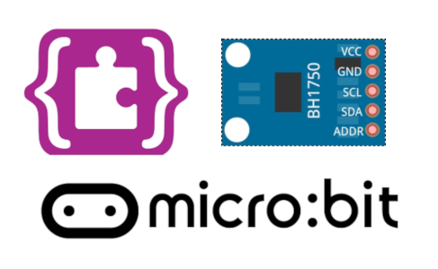

# BH1750

A MakeCode-PXT extension for the BH1750 digital mmbient light sensor module such as GY-302.

## Hardware 

This extension was developed to support the GY-302 BH1750 sensor module.
Only the continuous high-resolution measurement mode (1.0 lx) is supported.

## Wiring

Pins (GY-302 <--> Microbit Edge Connector)
- Vcc: 3V pin (3.3V)
- SCL: Pin 19
- SDA: Pin 20
- Gnd: Gnd pin (0V)

## License

MIT

## Supported Targets

PXT/microbit

## Acknowledgement

Thank to IoT Engineering Education @ KMUTNB
[https://www.facebook.com/iot.kmutnb/](https://www.facebook.com/iot.kmutnb/)

## Update

2019-Feb-17
